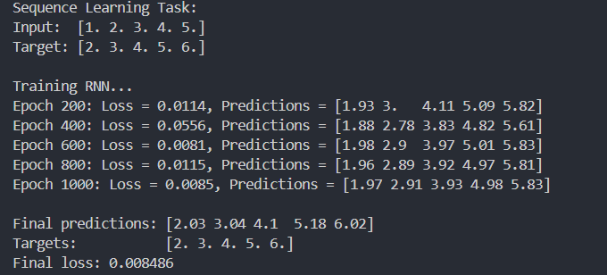
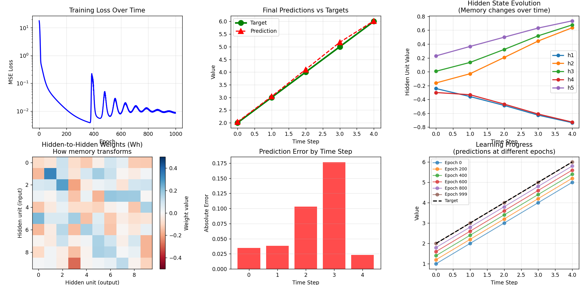

# 📘 LESSON 24: RECURRENT NEURAL NETWORKS (RNNs)

## 1. Introduction: Why Neural Networks Need Memory

### 🔹 The Sequential Data Problem

Imagine reading a sentence word by word:

```
"I love machine ___"
```

To predict the next word ("learning"), you need to remember:

- "I" (the subject)
- "love" (the verb expressing interest)
- "machine" (modifying the next noun)

If you only saw "machine" without context, you couldn't predict what comes next!

### 🔹 Real-World Sequential Data

**Text:** Words form sentences, meaning depends on order

```
"Dog bites man" ≠ "Man bites dog"
```

**Speech:** Sound waves over time, phonemes build words
**Time series:** Stock prices, temperature, heart rate
**Music:** Notes in sequence create melody
**Video:** Frames over time tell a story

**The problem:** CNNs and fully connected networks treat each input independently - they have no memory of what came before.

### 🔹 The Book Reading Analogy

**Regular neural network:** Reads each page independently, forgets everything

```
Page 1: "Once upon a time..."
Page 2: "...there was a princess..."
[Forgets page 1 content]
```

**Recurrent neural network:** Remembers previous pages while reading current one

```
Page 1: "Once upon a time..." [Stored in memory]
Page 2: "...there was a princess..." [Uses memory from Page 1]
```

### 🔹 Why Traditional Networks Fail

**Fully connected networks:**

```python
Input → Hidden → Output
# Each input processed independently
# No connection between time steps
```

**Problem:**

- Can't understand "I love machine learning" vs "Learning machine love I"
- Treats position 1, position 2, position 3 as completely different inputs
- No parameter sharing across time

### ✅ Quick Check:

Why can't a regular feedforward network process "What time is it?" correctly if words are shuffled?

---

## 2. RNN Architecture: The Memory Mechanism

### 🔹 The Core Idea - Hidden State

RNN maintains a **hidden state** (memory) that gets updated at each time step:

```
Time step t:
    Input: x_t
    Previous memory: h_{t-1}
    ↓
    Compute new memory: h_t
    Produce output: y_t
```

**The magic:** h_t contains information from ALL previous inputs!

### 🔹 The Mathematics

**Hidden state update:**

```
h_t = tanh(W_x × x_t + W_h × h_{t-1} + b)
```

**Output generation:**

```
y_t = W_y × h_t + c
```

**Where:**

- `x_t` = current input (word, number, feature vector)
- `h_{t-1}` = previous hidden state (memory)
- `h_t` = new hidden state (updated memory)
- `W_x` = input-to-hidden weights
- `W_h` = hidden-to-hidden weights (memory transformation)
- `W_y` = hidden-to-output weights
- `tanh` = activation function (typically -1 to 1)

### 🔹 Step-by-Step Example

**Task:** Predict next number in sequence [1, 2, 3, ...]

**Initialization:**

```
h_0 = [0, 0, 0]  # Initial memory (zeros)
```

**Time step 1:** Input = 1

```
h_1 = tanh(W_x × [1] + W_h × [0,0,0] + b)
    = tanh([0.5] + [0,0,0] + [0.1])
    = tanh([0.6])
    = [0.54]

y_1 = W_y × [0.54] = [1.08] ≈ 1
```

**Time step 2:** Input = 2

```
h_2 = tanh(W_x × [2] + W_h × [0.54] + b)
    = tanh([1.0] + [0.27] + [0.1])
    = [0.91]

y_2 = W_y × [0.91] = [1.82] ≈ 2
```

**Time step 3:** Input = 3

```
h_3 = tanh(W_x × [3] + W_h × [0.91] + b)
    = [0.98]

y_3 = W_y × [0.98] = [2.94] ≈ 3
```

Notice how h_t accumulates information from previous steps!

### 🔹 The Music Player Analogy

**RNN is like a music player with memory:**

```
Note 1 (C): Store in memory
Note 2 (E): Remember C, add E to memory
Note 3 (G): Remember C+E, add G to memory
→ Recognizes C major chord pattern!
```

Without memory, each note would be meaningless.

### ✅ Quick Check:

What information does the hidden state h_t contain?

---

## 3. Unrolling in Time: Visualizing RNN

### 🔹 The Loop vs Unrolled View

**Compact form (one cell):**

```
    x_t
     ↓
   [RNN] ← h_{t-1}
     ↓
    h_t
```

**Unrolled in time (showing the sequence):**

```
x_1 → [RNN] → h_1 → y_1
        ↓
x_2 → [RNN] → h_2 → y_2
        ↓
x_3 → [RNN] → h_3 → y_3
        ↓
       ...
```

**Key insight:** It's the SAME RNN cell, applied repeatedly with shared weights!

### 🔹 Weight Sharing Across Time

```python
# All time steps share the same weights
W_x = [same weights]  # for all t
W_h = [same weights]  # for all t
W_y = [same weights]  # for all t
```

**Why this matters:**

- Model learns temporal patterns, not position-specific patterns
- Much fewer parameters than separate networks per time step
- Can handle variable-length sequences

### 🔹 Information Flow

```
Input sequence: "I love machine learning"

x_1="I"        → h_1 (stores: subject)
x_2="love"     → h_2 (stores: subject + verb)
x_3="machine"  → h_3 (stores: subject + verb + object)
x_4="learning" → h_4 (stores: complete context)
```

Each h_t is a compressed summary of everything seen so far.

### 🔹 The Telephone Game Analogy

**RNN is like the telephone game, but perfect:**

```
Person 1: "The cat sat"
Person 2: Remembers + adds "on the"
Person 3: Remembers all + adds "mat"
→ Full message preserved through chain
```

Unlike the real telephone game, RNN (ideally) doesn't degrade information... except it does (vanishing gradients)!

### ✅ Quick Check:

Why do all time steps share the same weights?

---

## 4. Training RNNs: Backpropagation Through Time (BPTT)

### 🔹 The Challenge

To train an RNN, we need to compute gradients with respect to:

- W_x (input weights)
- W_h (hidden-to-hidden weights)
- W_y (output weights)

**Problem:** Loss at time t depends on all previous time steps!

### 🔹 Backpropagation Through Time

**Forward pass (same as before):**

```
t=1: h_1 = f(x_1, h_0)
t=2: h_2 = f(x_2, h_1)
t=3: h_3 = f(x_3, h_2)
...
Loss = Σ L(y_t, target_t)
```

**Backward pass (new complexity):**

```
∂Loss/∂W_y: Direct (like regular backprop)

∂Loss/∂W_h: Must flow through time!
  t=3: ∂L_3/∂W_h
  t=2: ∂L_2/∂W_h + ∂L_3/∂h_2 × ∂h_2/∂W_h
  t=1: ∂L_1/∂W_h + ∂L_2/∂h_1 × ∂h_1/∂W_h + ∂L_3/∂h_1 × ...
```

Gradient at early time step includes contributions from all future time steps!

### 🔹 Gradient Flow Visualization

```
Loss at t=4
     ↓
    h_4 ← gradient flows back
     ↓
    h_3 ← gradient flows back (multiplied)
     ↓
    h_2 ← gradient flows back (multiplied)
     ↓
    h_1 ← gradient flows back (multiplied)
     ↓
   W_h ← final gradient update
```

At each step, gradient gets multiplied by W_h and activation derivative.

### ✅ Quick Check:

Why is training RNNs more complex than training feedforward networks?

---

## 5. The Vanishing/Exploding Gradient Problem

### 🔹 The Vanishing Gradient Problem

**What happens:**

```
Gradient at t=1 = (∂h_2/∂h_1) × (∂h_3/∂h_2) × ... × (∂h_T/∂h_{T-1}) × ∂Loss/∂h_T
```

If each derivative < 1 (common with tanh/sigmoid), product becomes tiny:

```
0.5 × 0.5 × 0.5 × ... (T times) → nearly 0
```

**Effect:**

- Early time steps barely get updated
- Network can't learn long-term dependencies
- Forgets distant past

**The Memory Decay Analogy:**

```
Try remembering what you ate:
Yesterday: Easy! (gradient flows well)
Last week: Harder (gradient smaller)
Last month: Very difficult (gradient vanished)
```

### 🔹 The Exploding Gradient Problem

**What happens:**
If derivatives > 1, product becomes huge:

```
2.0 × 2.0 × 2.0 × ... (T times) → infinite
```

**Effect:**

- Weight updates become enormous
- Network becomes unstable
- Training diverges (NaN values)

**Symptoms:**

```python
Epoch 1: Loss = 2.5
Epoch 2: Loss = 1.8
Epoch 3: Loss = 0.9
Epoch 4: Loss = NaN  # Exploded!
```

### 🔹 Why This Happens - Mathematical Insight

**Chain rule for RNN:**

```
∂h_t/∂h_{t-k} = ∏(i=0 to k-1) ∂h_{t-i}/∂h_{t-i-1}
              = ∏(i=0 to k-1) W_h × tanh'(...)
```

If `||W_h||` < 1: Product → 0 (vanishing)
If `||W_h||` > 1: Product → ∞ (exploding)

### 🔹 Solutions Preview

**For vanishing gradients:**

- LSTM (Long Short-Term Memory) ← Tomorrow's topic!
- GRU (Gated Recurrent Unit)
- Better initialization
- Use ReLU instead of tanh

**For exploding gradients:**

- Gradient clipping

```python
if ||gradient|| > threshold:
    gradient = threshold × (gradient / ||gradient||)
```

### ✅ Quick Check:

Why do RNNs struggle to learn dependencies that are 100 time steps apart?

---

## 6. Python Implementation: Building Your First RNN

### 6.1 Simple Sequence Prediction

```python
import numpy as np
from tensorflow.keras.models import Sequential
from tensorflow.keras.layers import SimpleRNN, Dense

# Task: Predict next number in sequence
# Input: [0,1,2] → Output: 3
# Input: [1,2,3] → Output: 4

# Generate training data
def create_sequences(start, end, seq_length=3):
    X, y = [], []
    for i in range(start, end - seq_length):
        X.append(list(range(i, i + seq_length)))
        y.append(i + seq_length)
    return np.array(X), np.array(y)

X_train, y_train = create_sequences(0, 50)

# Reshape for RNN: (samples, timesteps, features)
X_train = X_train.reshape((X_train.shape[0], X_train.shape[1], 1))

print(f"X_train shape: {X_train.shape}")  # (47, 3, 1)
print(f"y_train shape: {y_train.shape}")  # (47,)

# Build RNN model
model = Sequential([
    SimpleRNN(10, activation='tanh', input_shape=(3, 1)),
    Dense(1)
])

model.compile(optimizer='adam', loss='mse', metrics=['mae'])
model.summary()

# Train
history = model.fit(
    X_train, y_train,
    epochs=200,
    verbose=0,
    validation_split=0.2
)

# Test
test_input = np.array([47, 48, 49]).reshape(1, 3, 1)
prediction = model.predict(test_input, verbose=0)
print(f"Input: [47, 48, 49] → Predicted: {prediction[0][0]:.2f} (Expected: 50)")
```

### 6.2 Understanding the Architecture

```python
"""
Model architecture breakdown:

Input shape: (3, 1)
  - 3 time steps
  - 1 feature per time step

SimpleRNN(10):
  - 10 hidden units (neurons in hidden state)
  - Parameters:
    • W_x: (1, 10)   - input to hidden
    • W_h: (10, 10)  - hidden to hidden
    • b: (10,)       - bias
    • Total: 1×10 + 10×10 + 10 = 120 parameters

Dense(1):
  - Maps hidden state (10 units) to output (1 value)
  - Parameters: 10×1 + 1 = 11

Total parameters: 131
"""
```

### 6.3 Visualizing Training Progress

```python
import matplotlib.pyplot as plt

def plot_training(history):
    """Plot loss curves"""
    plt.figure(figsize=(12, 4))

    plt.subplot(1, 2, 1)
    plt.plot(history.history['loss'], label='Train Loss')
    plt.plot(history.history['val_loss'], label='Val Loss')
    plt.title('Training Progress')
    plt.xlabel('Epoch')
    plt.ylabel('Loss')
    plt.legend()
    plt.grid(True)

    plt.subplot(1, 2, 2)
    plt.plot(history.history['mae'], label='Train MAE')
    plt.plot(history.history['val_mae'], label='Val MAE')
    plt.title('Mean Absolute Error')
    plt.xlabel('Epoch')
    plt.ylabel('MAE')
    plt.legend()
    plt.grid(True)

    plt.tight_layout()
    plt.show()

plot_training(history)
```

### 6.4 Text Generation Example

```python
from tensorflow.keras.preprocessing.text import Tokenizer
from tensorflow.keras.utils import to_categorical

# Sample text
text = "the quick brown fox jumps over the lazy dog"
words = text.split()

# Create word-to-index mapping
tokenizer = Tokenizer()
tokenizer.fit_on_texts([text])
vocab_size = len(tokenizer.word_index) + 1

# Create sequences
sequences = []
for i in range(1, len(words)):
    sequences.append(words[i-1:i+1])

# Convert to indices
X_text = []
y_text = []
for seq in sequences:
    X_text.append(tokenizer.texts_to_sequences([seq[0]])[0][0])
    y_text.append(tokenizer.texts_to_sequences([seq[1]])[0][0])

X_text = np.array(X_text).reshape(-1, 1, 1)
y_text = to_categorical(y_text, num_classes=vocab_size)

# Build model
text_model = Sequential([
    SimpleRNN(50, input_shape=(1, 1)),
    Dense(vocab_size, activation='softmax')
])

text_model.compile(optimizer='adam', loss='categorical_crossentropy')
text_model.fit(X_text, y_text, epochs=500, verbose=0)

# Generate next word
word = "the"
word_idx = tokenizer.texts_to_sequences([word])[0][0]
pred = text_model.predict(np.array([word_idx]).reshape(1, 1, 1), verbose=0)
next_word_idx = np.argmax(pred)
next_word = tokenizer.index_word[next_word_idx]
print(f'"{word}" → "{next_word}"')
```

### ✅ Quick Check:

What does the shape (None, 10, 1) mean for RNN input?

---

## 7. Real-World Applications

### 🔹 Natural Language Processing

**Sentiment Analysis:**

```
Input: "This movie is amazing!" → Positive
Process: Word by word, building context
Output: Sentiment score
```

**Machine Translation:**

```
English: "How are you?"
RNN encoder: Processes English
RNN decoder: Generates French "Comment allez-vous?"
```

### 🔹 Time Series Forecasting

**Stock Price Prediction:**

```python
# Input: Last 30 days of prices
# Output: Tomorrow's price

model = Sequential([
    SimpleRNN(50, return_sequences=True, input_shape=(30, 1)),
    SimpleRNN(50),
    Dense(1)
])
```

**Weather Forecasting:**

```
Input: Temperature, humidity, pressure over past week
Output: Tomorrow's weather
```

### 🔹 Speech Recognition

```
Audio waveform → Features (MFCCs)
     ↓
   [RNN processes sequence]
     ↓
   Text transcription
```

### 🔹 Music Generation

```python
# Train on Bach compositions
# Generate new music in similar style

# Input: Previous notes
# Output: Next note probability distribution
```

### 🔹 Video Analysis

```
Frame 1 → Frame 2 → Frame 3 → ...
   ↓         ↓         ↓
 [RNN remembers what happened]
   ↓
Action recognition: "Person is walking"
```

### ✅ Quick Check:

Why is RNN better than CNN for speech recognition?

---

## 8. RNN Variants & When to Use Them

### 🔹 Different RNN Architectures

**One-to-Many:** Image captioning

```
Image → [RNN] → "A" → "cat" → "on" → "table"
(single input, sequence output)
```

**Many-to-One:** Sentiment analysis

```
"This" → "movie" → "is" → "great" → [RNN] → Positive
(sequence input, single output)
```

**Many-to-Many (same length):** POS tagging

```
"I" → "love" → "cats"
 ↓      ↓       ↓
Noun  Verb   Noun
```

**Many-to-Many (different length):** Translation

```
"Hello world" (2 words) → "Bonjour le monde" (3 words)
```

### 🔹 Bidirectional RNN

Process sequence in both directions:

```
Forward:  I → love → cats
Backward: cats → love → I
Combine both contexts for each word
```

**Use when:** You have complete sequence (not real-time)

```python
from tensorflow.keras.layers import Bidirectional

model = Sequential([
    Bidirectional(SimpleRNN(50), input_shape=(10, 1)),
    Dense(1)
])
```

### 🔹 Stacked RNN

Multiple RNN layers:

```
Input → RNN Layer 1 → RNN Layer 2 → RNN Layer 3 → Output
```

**Use when:** Need hierarchical temporal patterns

```python
model = Sequential([
    SimpleRNN(50, return_sequences=True, input_shape=(10, 1)),
    SimpleRNN(50, return_sequences=True),
    SimpleRNN(50),
    Dense(1)
])
```

### ✅ Quick Check:

When would you use bidirectional RNN vs regular RNN?

---

## 9. Summary: Your RNN Foundation

### 🔹 What You Now Know

After this lesson, you should be able to:

✅ **Explain** why sequential data needs special neural network architectures
✅ **Understand** how hidden states enable memory in RNNs
✅ **Calculate** how information flows through time steps
✅ **Recognize** vanishing/exploding gradient problems
✅ **Implement** simple RNNs for sequence tasks
✅ **Choose** appropriate RNN architectures for different problems
✅ **Apply** RNNs to text, time series, and speech tasks

### 🔹 Key Concepts Review

**Hidden State:**

```
h_t = f(W_x × x_t + W_h × h_{t-1} + b)
```

- Memory that carries information through time
- Updated at each step
- Size determines model capacity

**Weight Sharing:**

- Same weights used at all time steps
- Enables variable-length sequences
- Fewer parameters than position-specific weights

**Challenges:**

- Vanishing gradients (can't learn long dependencies)
- Exploding gradients (unstable training)
- Sequential processing (slow, can't parallelize)

### 🔹 RNN vs Other Architectures

| Architecture    | Best For           | Limitation                |
| --------------- | ------------------ | ------------------------- |
| **Feedforward** | Independent inputs | No sequence memory        |
| **CNN**         | Spatial patterns   | Fixed receptive field     |
| **RNN**         | Sequential data    | Vanishing gradients, slow |
| **LSTM**        | Long sequences     | More complex, slower      |
| **Transformer** | Parallel sequences | Needs more data           |

### 🔹 When to Use RNN

**✅ Use RNN when:**

- Data has temporal/sequential structure
- Order matters for understanding
- Variable-length inputs/outputs
- Need to maintain context

**❌ Don't use RNN when:**

- Inputs are independent
- Sequence is very long (use LSTM/Transformer)
- Need parallel processing (use Transformer)
- Spatial patterns matter more (use CNN)

---

## 10. Practice Questions

### 🎤 Test Your RNN Mastery:

**Conceptual Understanding:**

1. Why does an RNN need a hidden state?
2. What information is stored in h_t?
3. How does weight sharing benefit RNNs?
4. Why can't you use different weights at each time step?

**Mathematical Application:** 5. Given h_0 = [0, 0], x_1 = 2, W_x = [[0.5]], W_h = [[0.3, 0.2]], compute h_1 6. If gradient shrinks by 0.5 at each step, what's gradient after 10 steps? 7. Calculate parameters for SimpleRNN(hidden=20, input=5)

**Practical Implementation:** 8. Design an RNN for predicting next character in text 9. Your RNN loss suddenly becomes NaN. What's likely wrong? 10. How would you modify RNN for bidirectional processing?

**Real-World Scenarios:** 11. Would you use RNN for image classification? Why/why not? 12. Compare RNN vs CNN for video analysis - which would you choose? 13. Design an RNN system for autocomplete suggestions

**Advanced:** 14. Explain backpropagation through time in simple terms 15. Why might stacking multiple RNN layers help? 16. When would you use many-to-one vs many-to-many architecture?

Understanding RNNs is crucial - they're the foundation for understanding how AI processes sequences, from chatbots to translation systems!

_Ready to remember the past and predict the future! 🔄_

---

## 🧠 RNN Training Outputs & Visualizations

### 🔹 Console Training Logs

Below is the console output showing how the RNN learns to predict sequential numbers step by step:



### 🔹 Training Visualizations

Visualization of RNN training progress — including loss curves, hidden state evolution, and learning progress over epochs:



---
